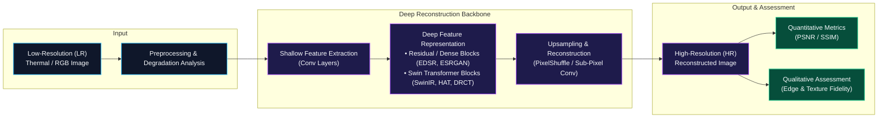

<div align="center">

# Akash Maurya
### **AI/ML Engineer | Computer Vision | Deep Learning**

[](https://linkedin.com/in/akash-maurya-97617a32)
[](https://github.com/mauryaakash-ai)
[](mailto:mauryaakash2005@gmail.com)
[-blue?style=flat)](#education)

```
AI/ML  ->  Computer Vision  ->  Super-Resolution & Restoration  ->  Self-Supervised Learning  ->  Applied AI
```

<p align="center">
  <b>B.Tech AI student at Bennett University</b> with research and engineering experience in <b>Deep Learning, Image Super-Resolution, and Self-Supervised Representation Learning</b>. Experienced in training, evaluating, and benchmarking 10+ CNN and Transformer-based vision architectures across benchmark, real-world, and thermal datasets.
</p>

---

</div>

## Primary Focus & Core Competencies

- **Image Super-Resolution & Restoration:** Specialized in CNN and Vision Transformer backbones (EDSR, ESRGAN, Real-ESRGAN, SwinIR, HAT, DRCT, SRTTA, SRCNN, FSRCNN, VDSR).
- **Self-Supervised Representation Learning:** Contrastive learning frameworks (SimCLR, NT-Xent loss) for label-efficient representation extraction.
- **Thermal & Biometric Vision:** Radiometric structure preservation in thermal imagery and specular reflection mitigation for animal biometrics.
- **Evaluation & Benchmarking:** Dual-metric analysis (PSNR / SSIM) combined with visual artifact, edge preservation, and structural fidelity assessment.

---

## Core Technical Pipeline

### Image Super-Resolution & Restoration Architecture



---

## Technical Stack

<div align="center">

| Category | Technologies & Tools |
| :--- | :--- |
| **Languages** | `Python` `C` `C++` `SQL` |
| **Frameworks & Libraries** | `PyTorch` `TensorFlow` `OpenCV` `Scikit-learn` `NumPy` `Pandas` `Matplotlib` `Flask` |
| **Architectures** | `EDSR` `ESRGAN` `Real-ESRGAN` `SwinIR` `HAT` `DRCT` `SRTTA` `SRCNN` `FSRCNN` `VDSR` `SimCLR` `CNNs` `Transformers` |
| **Developer Tools** | `Git` `GitHub` `Linux / Ubuntu` `VS Code` `Jupyter Notebook` `SQLite` |

</div>

---

## Featured Research & Projects

### 1. Thermal Image Super-Resolution Research
* Enhanced degraded spatial resolution of low-cost thermal sensors while preserving radiometric temperature gradients and edge boundaries.
* Benchmarked classical CNN models (SRCNN, FSRCNN, VDSR, EDSR) and Vision Transformers (SwinIR) using PSNR, SSIM, and thermal boundary analysis.
* **Stack:** Python, PyTorch, OpenCV, NumPy, Matplotlib.

### 2. Real-World Super-Resolution Benchmark
* Comparative study of modern super-resolution networks across diverse degradation distributions on DIV2K, RealSR, Urban100, Vehicle-10, and PlantVillage Disease datasets.
* Evaluated models: EDSR, VDSR, ESRGAN, Real-ESRGAN, SwinIR, HAT, DRCT, SRTTA.
* **Stack:** PyTorch, Torchvision, Scikit-learn, Linux.

### 3. SimCLR Self-Supervised Representation Learning
* Implemented contrastive visual representation learning using NT-Xent loss, stochastic data augmentation pairs, a shared CNN backbone, and a nonlinear projection head.
* Validated representation quality via linear evaluation protocols without full class-label supervision.
* **Stack:** PyTorch, Torchvision, Matplotlib.

### 4. Animal Biometric Identification
* Research on non-invasive identification using corneal imaging; mitigated corneal specular reflection for buffalo iris feature isolation and explored pattern recognition for snake identification.
* **Stack:** OpenCV, Python, Scikit-learn.

### 5. KrishiShram — Farm Labour & Wage Management System
* Full-stack web application automating daily farmer wage calculations, labour attendance, and database-backed record keeping.
* **Stack:** Python, Flask, SQLite, RESTful APIs, HTML/CSS/JS, Git.

### 6. ImageLab — K-Means Image Compression
* Pixel color quantization using K-Means clustering, achieving 40%–60% file size reduction while preserving perceptual image quality.
* **Stack:** Python, OpenCV, Scikit-learn.

---

## Experience

* **Summer Research Intern** — *ViSecure Systems Pvt. Ltd.* *(June 2026 – August 2026)*
  - Researched 10+ Super-Resolution architectures and built synthetic/real-world paired dataset pipelines.
  - Implemented self-supervised contrastive learning workflows (SimCLR) for label-efficient vision tasks.

* **Research Intern** — *Ashoka University* *(June 2026 – September 2026)*
  - Researched animal biometric identification, image acquisition protocols, illumination correction, and specular reflection mitigation.

* **Co-Founder & General Secretary** — *RoboGenesis Club, Bennett University* *(2024 – Present)*
  - Leading a student community of 60+ members and 23 core team members; conducting technical workshops in Python, OpenCV, and robotics.

---

## Education, Honors & Certifications

* **Bennett University** — *B.Tech in Artificial Intelligence* (2024 – 2028) | **CGPA: 8.71 / 10**
* **DST INSPIRE Scholarship** — Awarded by the *Department of Science & Technology*, Govt. of India.
* **Academic Silver Medal** — *Top 10 State Merit List*, Class XII (UP Board: 88.0% | Class X: 92.17%).
* **Certifications:** *Neural Networks and Deep Learning (DeepLearning.AI)* • *Google AI Essentials* • *Prompt Engineering (Infosys)*.

---


